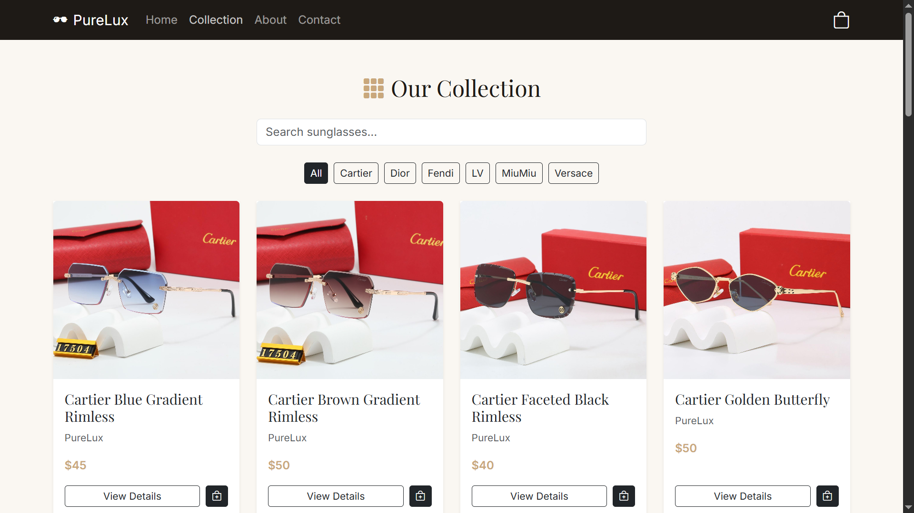

# PureLux – Luxury Sunglasses Store

A full-stack e-commerce web application for browsing and purchasing luxury sunglasses. The project provides customers with a smooth shopping experience while giving administrators the ability to manage products and customer orders through a dedicated admin panel.

---

# Overview

PureLux is an online luxury sunglasses store built using **React**, **Node.js**, **Express.js**, and **MySQL**. The application allows users to browse products, search and filter sunglasses, manage their shopping cart, and complete the checkout process. It also includes an admin dashboard where products can be added, edited, or removed, customer orders can be viewed, and product images can be uploaded.

---

# Features

## Customer Features

- Browse available sunglasses
- Search and filter products
- View product details
- Add and remove items from the shopping cart
- Update product quantities
- Guest checkout
- User registration and login
- Order confirmation

## Admin Features

- Secure administrator login
- View dashboard statistics
- Add new products
- Edit existing products
- Delete products
- Upload product images
- View customer orders

---

# Technologies Used

## Frontend

- React 18
- React Router
- Bootstrap 5
- React Context API
- Bootstrap Icons

## Backend

- Node.js
- Express.js
- MySQL
- Multer (for images)
- CORS

---

```

---

# Installation

## Prerequisites

Before running the project, make sure you have:

- Node.js (version 14 or later)
- MySQL
- npm

## Clone the Repository

```bash
git clone https://github.com/laraB112/Sunglasses-store.git
cd Sunglasses-store
```

## Backend Setup

```bash
cd backend

npm install
```

Create a MySQL database, then import the `database.sql` file.

Start the backend server:

```bash
node server.js
```

## Frontend Setup

```bash
cd ../frontend

npm install

npm start
```

After running both servers, the application will be available at:

- Frontend: http://localhost:3000
- Backend: http://localhost:8083

---

# Default Admin Account

Email:

```text
LaraAdmin@gmail.com
```

Password:

```text
admin123
```

---

# API Routes

The backend includes routes for:

- Retrieving all products
- Retrieving a single product
- Adding a new product
- Updating an existing product
- Deleting a product
- Viewing all customer orders
- Creating a new order
- User registration
- User login

---

# Database

The database contains three main tables:

## Users

Stores customer account information including name, email, password, phone number, and shipping address.

```sql
CREATE TABLE users (
    id INT PRIMARY KEY AUTO_INCREMENT,
    name VARCHAR(100) NOT NULL,
    email VARCHAR(100) UNIQUE NOT NULL,
    password VARCHAR(255) NOT NULL,
    phone VARCHAR(20),
    address TEXT,
    city VARCHAR(50)
);
```

## Products

Stores information about each sunglasses product available in the store.

```sql
CREATE TABLE products (
    productId INT PRIMARY KEY AUTO_INCREMENT,
    name VARCHAR(100) NOT NULL,
    brand VARCHAR(50) NOT NULL,
    price DECIMAL(10,2) NOT NULL,
    category VARCHAR(50) NOT NULL,
    image_url VARCHAR(255),
    description TEXT
);
```

## Orders

Stores customer order details including shipping information, total price, and purchased items.

```sql
CREATE TABLE orders (
    id INT PRIMARY KEY AUTO_INCREMENT,
    customer_name VARCHAR(100) NOT NULL,
    customer_email VARCHAR(100) NOT NULL,
    customer_phone VARCHAR(20),
    shipping_address TEXT,
    city VARCHAR(50),
    total DECIMAL(10,2) NOT NULL,
    items JSON NOT NULL
);

The items column is stored as JSON to simplify the order structure, allowing all product details (name, quantity, price) to be saved in a single column without requiring a separate order_items table and complex JOIN queries.

```

---

# Screenshots

## Users

### Homepage


### Products Page



### About Us page 


### Featured Products 


### Contact Us


### User Login


### User Registration 


### Footer


### Collection List


### Filter Feature


### Confirmation Alert


### Shopping Cart


### Checkout


## Admin

### Admin Login


### Admin Dashboard


### Product Management


### Edit Product


### Orders


### Product Adding


---

# Future Improvements

Possible enhancements for future versions include:

- Online payment integration
- Wishlist functionality
- Product reviews and ratings
- Order tracking
- Email notifications
- Improved mobile responsiveness

---

# Author

**Lara Al Bayasli**
**Student ID:** 12232131

---

# Academic Information

**Course:** CSCI426 – Advanced Web Programming

**Semester:** Summer 2026

**Project Completed:** August 2026

---
