# PureLux - Luxury Sunglasses Store

## Project Description
PureLux is a luxury sunglasses e-commerce platform built with React. Users can browse premium sunglasses, view product details, add items to their shopping cart, and complete the checkout process. This website features a responsive design that works on all devices and offers a curated collection of luxury sunglasses from brands such as Cartier, Dior, Fendi, Louis Vuitton (LV), Miu Miu, and Versace.

> **Note:** This is a **frontend-only** implementation that demonstrates the user interface, shopping cart functionality, and checkout flow using mock data. All product data is stored locally, and the cart is persisted using the browser's `localStorage`.
## Features
- Browse luxury sunglasses by brand category
- Search for specific styles
- View product details with descriptions
- Add items to shopping cart
- Manage cart quantities
- Checkout with Cash on Delivery option
- $4 shipping across Lebanon
- Cart persistence using localStorage
- Responsive design (mobile-friendly)

## Technologies Used
- React 18
- React Router (for navigation)
- Bootstrap 5 (for styling)
- React Context API (for cart state management)
- Bootstrap Icons
- Git & GitHub
- Mock Data (no backend)

## Setup Instructions

### Prerequisites
- Node.js (v14 or higher)
- npm

### Installation
```bash
# Clone the repository
git clone https://github.com/laraB112/sunglasses-store.git

# Navigate to project folder
cd frontend

# Install dependencies
npm install

# Start the development server
npm start
```
Open **http://localhost:3000** in your browser.

### UI Screenshots

## Homepage
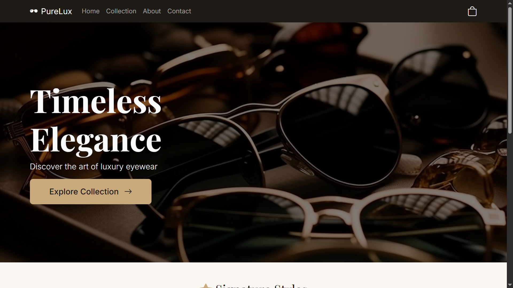
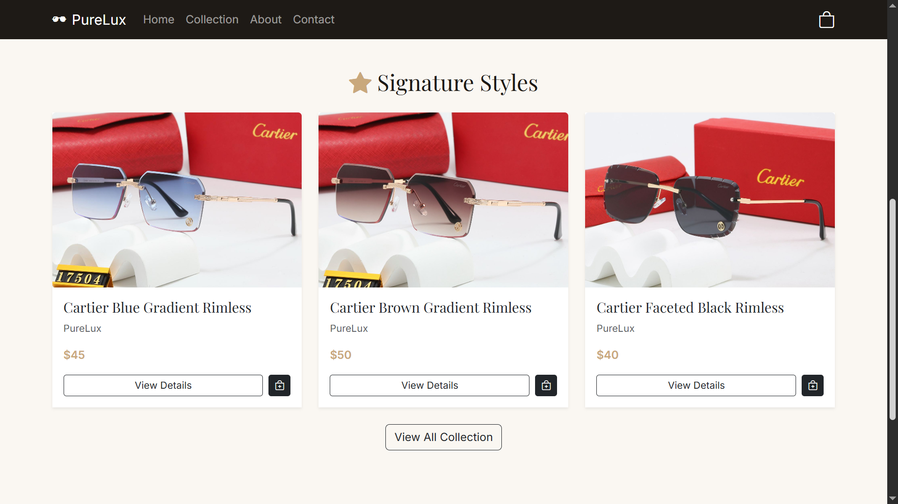
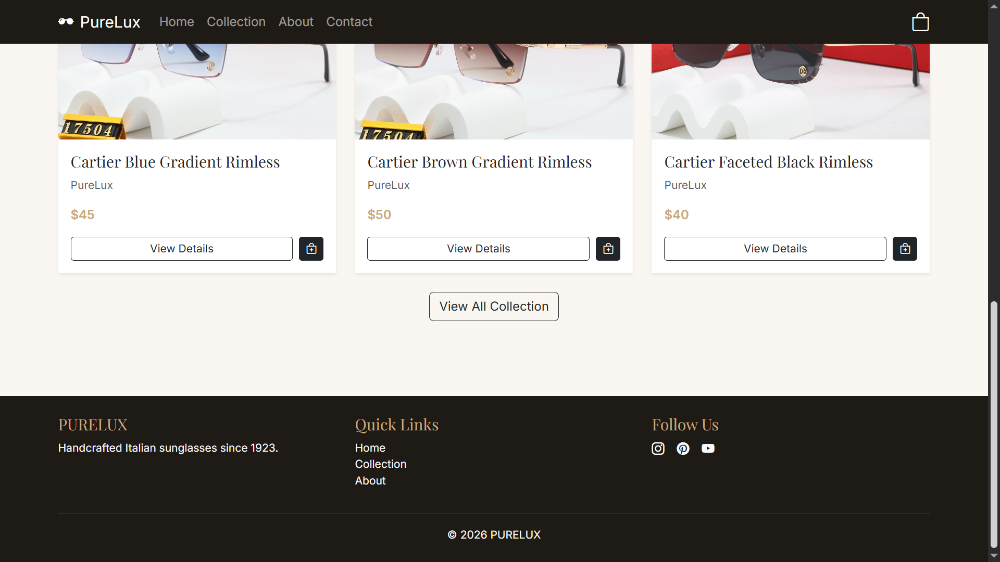

## About Us
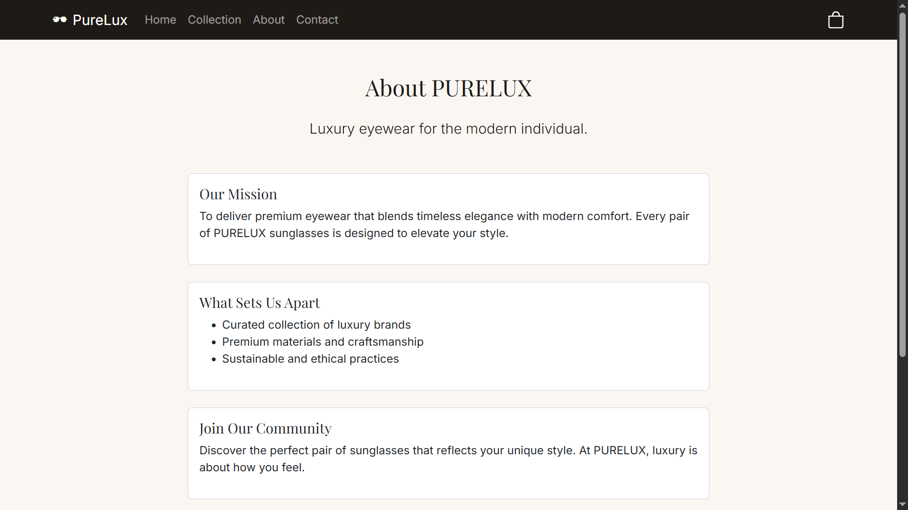

## Collection Page

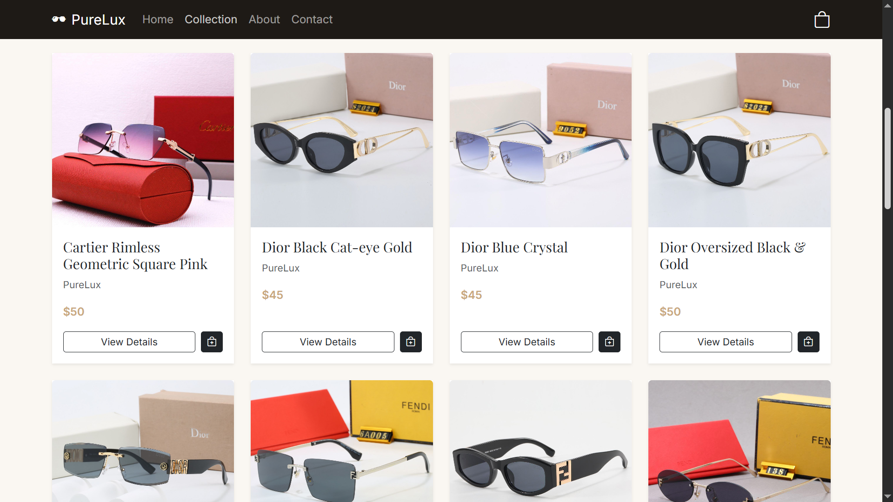

## Filter Product Feature
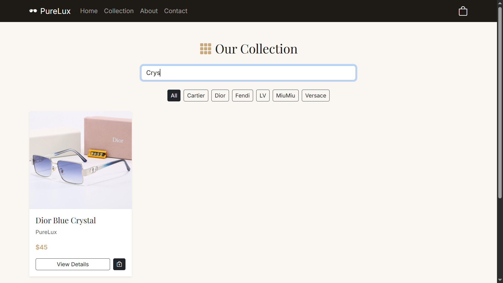

## Product Details
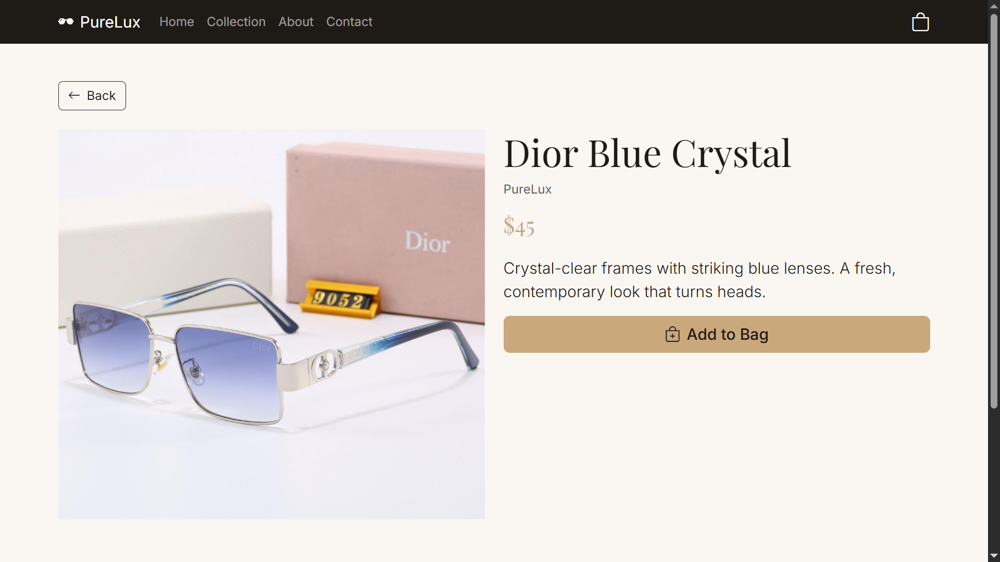

## Contact Us
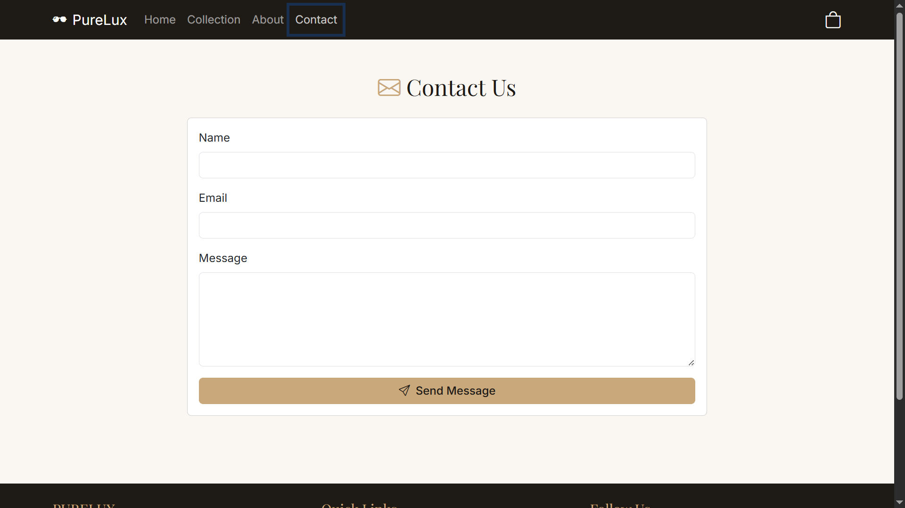

## Cart
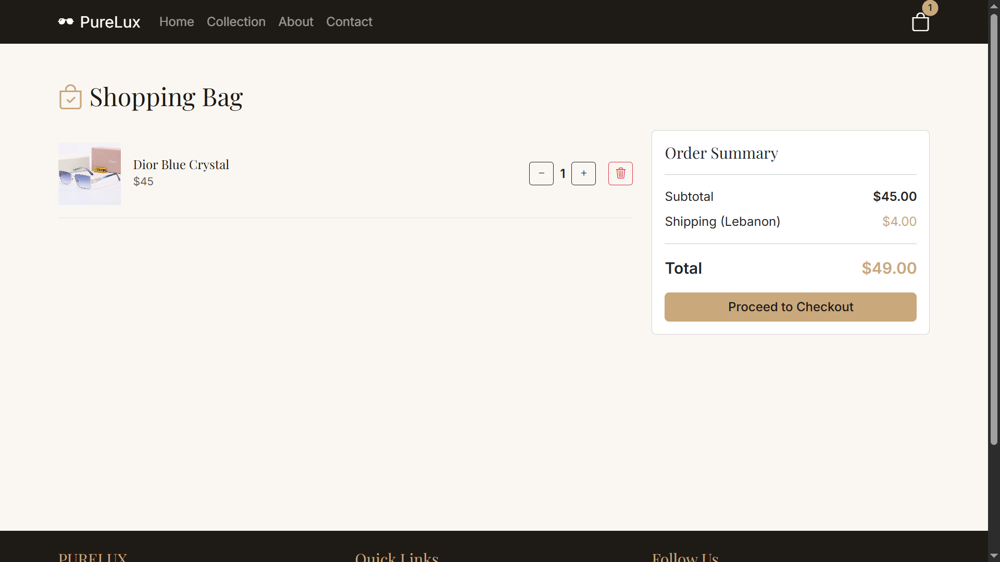

## Checkout
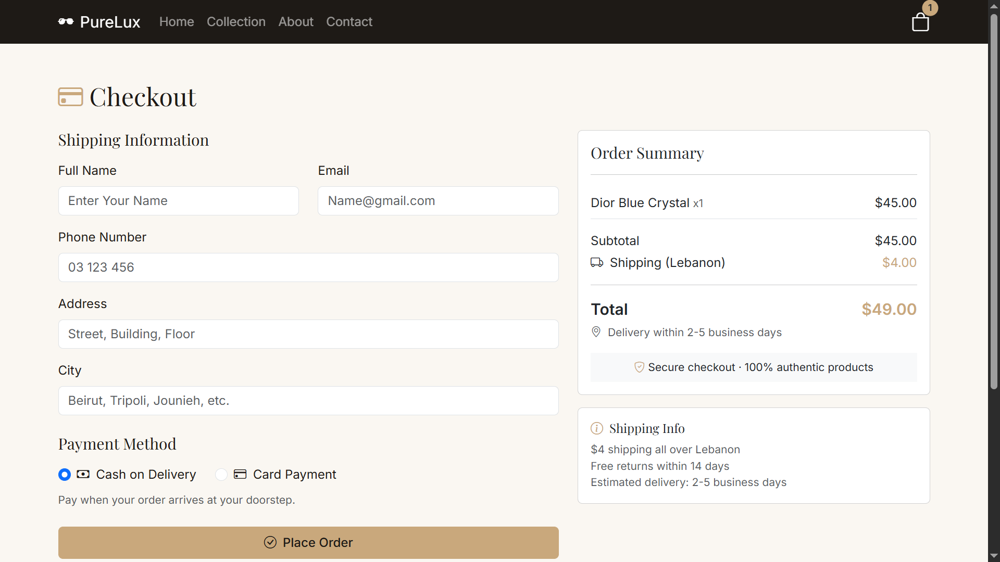

## Alerts When Confirming Order
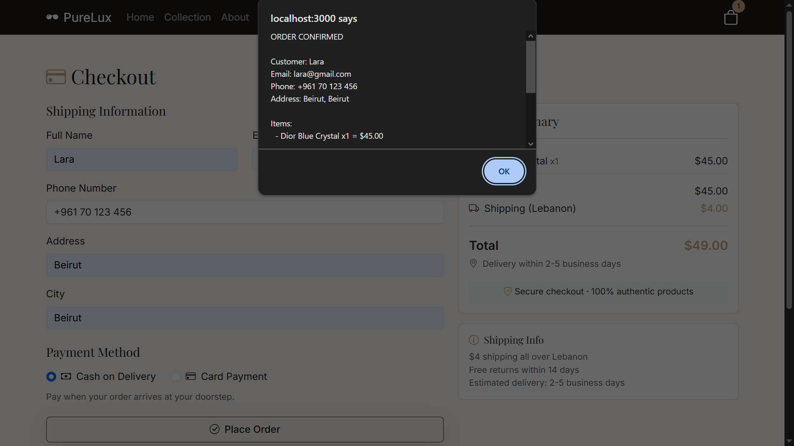
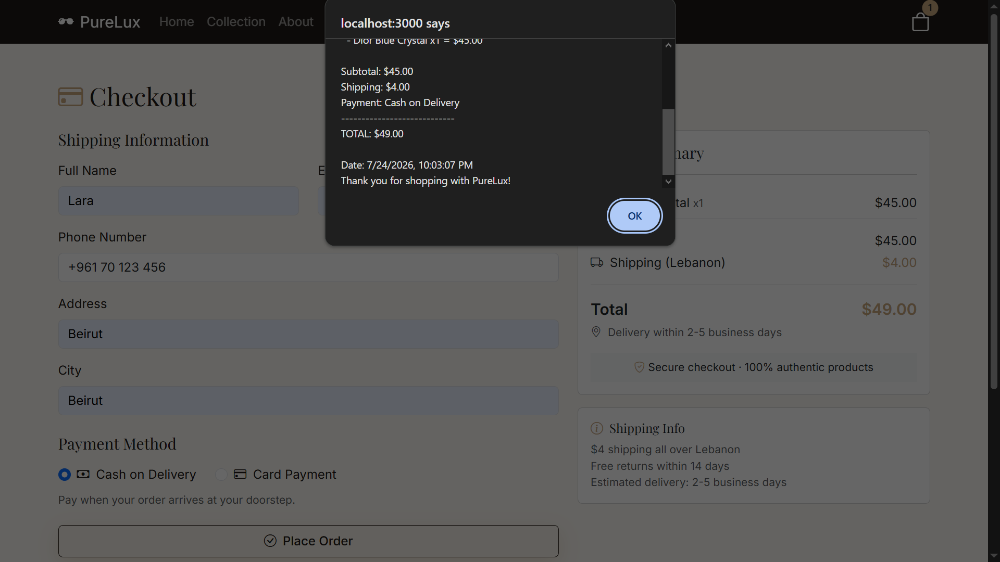


## Author

**Lara Albayasli**